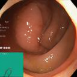
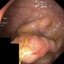
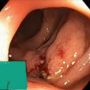
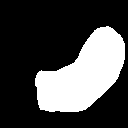
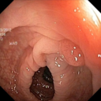
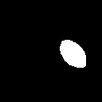
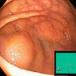
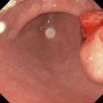
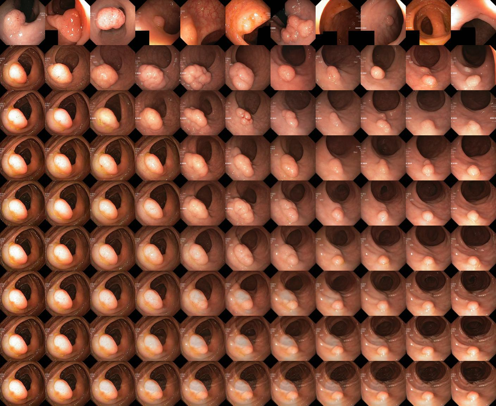

# RePolyp
### A Framework for Generating Realistic Colon Polyps with Corresponding Segmentation Masks using Diffusion Models

## Diffusion models :heart:
- Diffusion-based models, to see how to train a DDPM look at https://github.com/openai/guided-diffusion, and to use a custom dataset look at https://github.com/openai/improved-diffusion 

- To see how you can use pre-trained DDPM models for inpainting look at https://github.com/andreas128/RePaint

## Data used
https://datasets.simula.no/hyper-kvasir/
### Unlabeled part of Hyper-Kvasir 99,417 :raised_hands:
### Kvasir-SEG 1000 polyp images with their corresponding masks :mag_right:
### Labeled images from HyperKvasir Cecum 1009 images, Ileum 9 images, all Ulcerative Colitis with different gradings 851 images. 
#### ETIS Larib Polyp DB 196 images with corresponding masks, used for validation 
#### CVC-ClinicDB 612 images with corresponding masks, used for validation

# Step-by-step guide for generating polyp images with mask

We hold out 5% unlabeled images, 20% polyps, and 20% clean labeled images to compute FID against

1. We train our diffusion model on a large part of the unlabeled dataset in Hyperkvasir on partial images best FID(Cosine 300K 0.1 dropout - 18.80). Pre-trained model 1

2. Fine-tune diffusion models on cropped-out polyps tested 0, 0.1, and 0.3 dropout best FID(Cosine 18K 0.3 dropout - 69.51). Fine-tuned model 1

3. Train a new diffusion model on complete images in Hyperkvasir and pick the model with the best FID(Linear 500K - 25.83). Pre-trained model 2

4. Generate samples and pick the model with the best FID score fine-tuned on clean images(0.3 dropout 20K - 51.76). Fine-tuned model 2

5. RePaint cropped polyps with clean background and get FID 128.83. We use these images for segmentation purposes result of adding these synthetic images is shown below.


## Validation 200 Kvasir-SEG images
| Dataset  | IoU            | mIoU           | DSC            | Precision      | Recall         |
|----------|----------------|----------------|----------------|----------------|----------------|
| Baseline | 0.762          | 0.732          | 0.840          | 0.871          | 0.821          |
| +800     | **0.785** | **0.766** | **0.857** | **0.913** | **0.826** |


## Validation ETIS Larib Polyp DB
| Dataset  | IoU            | mIoU           | DSC            | Precision      | Recall         |
|----------|----------------|----------------|----------------|----------------|----------------|
| Baseline | 0.351          | 0.470          | 0.408          | 0.583          | 0.709          |
| +800     | **0.396** | **0.492** | **0.451** | **0.604** | **0.727** |

## Validation CVC-ClinicDB 
| Dataset  | IoU            | mIoU          | DSC            | Precision      | Recall         |
|----------|----------------|---------------|----------------|----------------|----------------|
| Baseline | 0.642          | 0.628         | 0.735          | 0.831          | 0.720          |
| +800     | **0.654** | **0.66** | **0.738** | **0.869** | **0.733** |

## Polyp Images 128x128
Generated polyp images             |  Real polyp images from Kvasir-SEG 
:-------------------------:|:-------------------------:
  |  
   |  
   |  
 
 
 ## Bonus - Interpolation 
To interpolate between two images using your DDPM can you use the following flags in the guided-diffusion folder. Make sure you use the same flags as the model you trained, for example same amount attention_resolutions etc. --rescale_timesteps needs to be True. Interpolation should create 99 images a example of interpolation between two polyps is shown below with t intervals of [0,125,250,375,500,625,750,875,999]. Images from left to right are [reconstructed src1, λ=0.1,λ=0.2,...,λ=0.9,reconstructed src2]
```
MODEL_FLAGS="--attention_resolutions 32,16,8 --image_size 128 --num_channels 128 --num_heads 4 --num_res_blocks 2 --learn_sigma True --resblock_updown True --use_fp16 True --use_scale_shift_norm True"
DIFFUSION_FLAGS="--diffusion_steps 1000 --noise_schedule linear --rescale_learned_sigmas False --rescale_timesteps True --interpolate True --src1 images/img1.jpg --src2 images/img2.jpg"

python scripts/image_sample.py --model_path your/model/path.pt $MODEL_FLAGS $DIFFUSION_FLAGS
 
```
